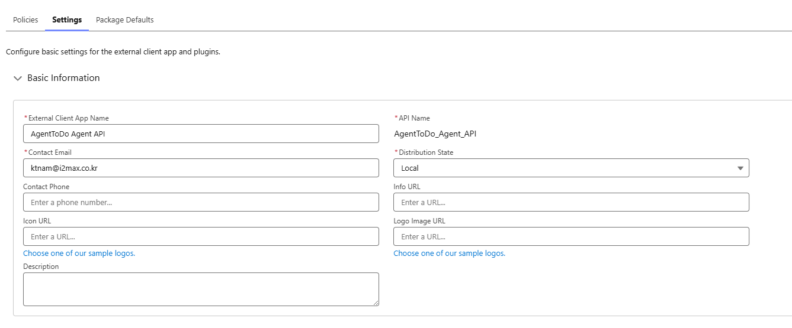
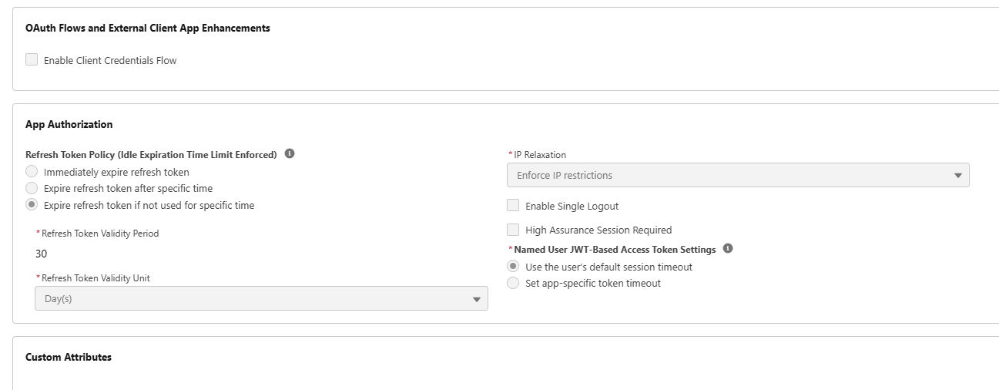
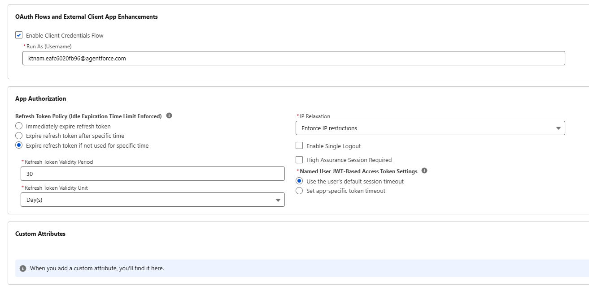
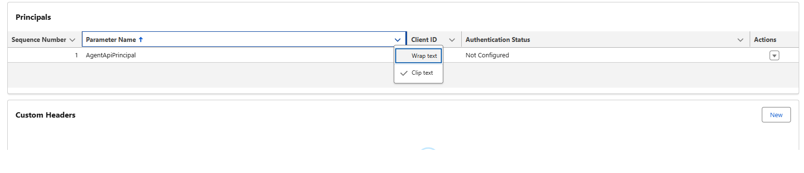
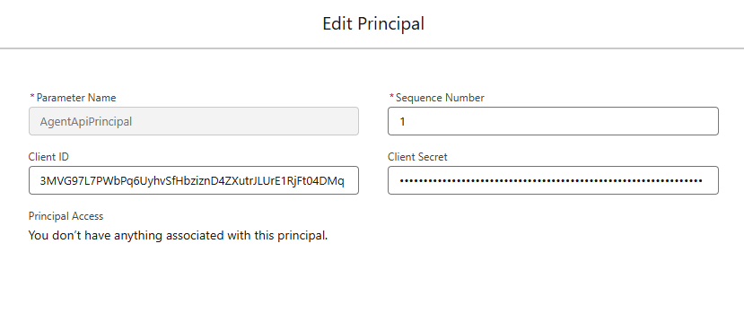
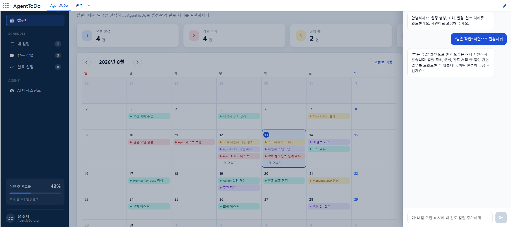

# AgentToDo 만들기 — Agentforce를 내 앱에서 제어하기

이 문서는 AgentToDo를 **처음부터 직접 만들기 위한 학습 가이드**입니다.
완성된 코드를 설명하는 문서가 아니라, 같은 것을 다시 만들 때 **어떤 순서로,
왜 그런 판단을 했는지**를 따라갈 수 있게 쓴 문서입니다.

실패한 시도와 그 원인도 그대로 적었습니다. 이 프로젝트에서 가장 오래 걸린 부분은
코드를 쓰는 시간이 아니라 **막힌 곳의 원인을 잘못 짚은 시간**이었고, 그게 가장
배울 게 많은 부분이기 때문입니다.

---

## 목차

1. [무엇을 만드는가](#1-무엇을-만드는가)
2. [전체 구조 — 조각들이 어떻게 맞물리는가](#2-전체-구조--조각들이-어떻게-맞물리는가)
3. [사전 준비](#3-사전-준비)
4. [1단계 · 데이터 모델](#4-1단계--데이터-모델)
5. [2단계 · LWC 화면](#5-2단계--lwc-화면)
6. [3단계 · Agentforce 에이전트](#6-3단계--agentforce-에이전트)
7. [4단계 · 앱에서 에이전트 호출하기 (Agent API)](#7-4단계--앱에서-에이전트-호출하기-agent-api)
8. [5단계 · 에이전트가 화면을 제어하게 하기](#8-5단계--에이전트가-화면을-제어하게-하기)
9. [함정 모음 — 내가 빠졌던 곳](#9-함정-모음--내가-빠졌던-곳)
10. [검증하는 습관](#10-검증하는-습관)
11. [다음에 해볼 것](#11-다음에-해볼-것)

---

## 1. 무엇을 만드는가

일정 관리 앱입니다. 다만 **목적은 일정 관리가 아니라 "Agentforce를 내가 만든 앱에서
어떻게 제어하는가"를 익히는 것**입니다. 그래서 판단이 갈릴 때마다 "일정 앱으로서
더 나은 쪽"이 아니라 "에이전트 제어를 더 잘 보여 주는 쪽"을 골랐습니다.

완성하면 이런 것이 됩니다.

- 캘린더·목록 화면에서 일정을 직접 관리할 수 있고
- 같은 화면의 대화 패널에서 **자연어로** 일정을 조회·생성·완료 처리할 수 있고
- **"받은 작업 화면으로 전환해줘"라고 말하면 실제로 화면이 바뀝니다**

마지막 항목이 이 프로젝트의 핵심입니다. 에이전트가 데이터를 다루는 것은 흔하지만,
에이전트가 **내 앱의 UI를 제어**하려면 별도의 설계가 필요합니다.

---

## 2. 전체 구조 — 조각들이 어떻게 맞물리는가

먼저 완성형의 호출 흐름을 봐 두면 이후 단계가 왜 필요한지 이해하기 쉽습니다.

```
[브라우저]
  LWC 대화 패널
      │ ① @AuraEnabled Apex 호출
      ▼
  AgentToDoAgentService (Apex)
      │ ② Named Credential 로 콜아웃
      ▼
  Named Credential ─ External Credential ─ External Client App
      │ ③ OAuth 토큰 자동 획득
      ▼
  https://api.salesforce.com/einstein/ai-agent/v1   ← Agent API
      │ ④ 세션 시작 / 메시지 전송
      ▼
[서버]
  AgentToDo_Svc_Assistant  (Agent Script 로 정의한 에이전트)
      │ ⑤ LLM 이 어떤 Action 을 쓸지 판단
      ▼
  Agent Action (Invocable Apex)
      │ ⑥ SOQL / DML
      ▼
  AgentToDo_Task__c  (커스텀 오브젝트)

  ※ 화면 전환은 이 경로로 돌아올 수 없어서 별도 채널을 씁니다
  Agent Action ─ 플랫폼 이벤트 발행 ─▶ LWC 가 empApi 로 구독 ─▶ 화면 전환
```

**여기서 미리 알아둘 것이 하나 있습니다.** ④의 응답에는 "⑤에서 어떤 Action이
실행됐는지"가 실려 오지 않습니다. 이 제약 하나가 8단계 설계 전체를 결정합니다.

### 왜 External Client App이 필요한가

일정 관리 앱(2단계)까지는 인증 설정이 전혀 없었습니다. 그런데 Agent API를 붙이는
순간 External Client App, External Credential, Named Credential이 줄줄이 필요해집니다.
**무엇이 달라졌길래 그럴까요?**

#### 조직 안과 밖의 차이

```
[일정 관리 앱 — 인증 설정 불필요]

  브라우저 (로그인된 사용자 세션)
      │  @AuraEnabled Apex 호출
      ▼
  AgentToDoController          ← 같은 org, 같은 세션
      │  SOQL / DML
      ▼
  AgentToDo_Task__c            ← 같은 org

  ↑ 조직 경계를 한 번도 넘지 않습니다


[Agent API 호출 — 인증 설정 필요]

  AgentToDoAgentService
      │  HTTP 콜아웃  ← ⚠️ 여기서 org 밖으로 나갑니다
      ▼
  https://api.salesforce.com   ← 내 org 도메인이 아닙니다
```

핵심은 **`api.salesforce.com` 이 내 조직이 아니라는 점**입니다.

내 org의 주소는 `orgfarm-....my.salesforce.com` 입니다. Agent API가 사는
`api.salesforce.com` 은 **Salesforce API Platform(SFAP)** 이라는 별도 서비스이고,
Salesforce가 운영하지만 내 조직 입장에서는 **외부 시스템**입니다.

Apex에서 외부로 나가는 HTTP 콜아웃은 Salesforce가 무조건 막습니다. 나가려면
두 가지가 필요합니다.

| 필요한 것         | 이유                                                      |
| ----------------- | --------------------------------------------------------- |
| 등록된 엔드포인트 | 아무 데나 못 나갑니다 (Named Credential 또는 Remote Site) |
| 인증 자격 증명    | 받는 쪽이 "너 누구냐"를 묻습니다                          |

#### 세션 ID를 쓰면 안 되나요?

안 됩니다. 이게 헷갈리는 지점입니다.

로그인한 사용자의 세션 ID는 **내 org 인스턴스에 대해서만** 유효합니다.
`api.salesforce.com` 은 다른 서비스라 그 세션을 모릅니다. SFAP는 **`sfap_api`
스코프를 가진 OAuth 액세스 토큰**을 요구합니다.

그리고 그런 토큰을 발급받으려면 **등록된 OAuth 클라이언트**가 있어야 합니다.
그게 External Client App입니다. (예전 이름이 Connected App이고, External Client App이
그 후속입니다.)

#### 왜 클라이언트 자격 증명 흐름인가

OAuth에는 여러 흐름이 있는데, 보통은 사용자가 브라우저에서 로그인 화면을 보고
"허용"을 누르는 방식입니다. 하지만 우리 상황은 다릅니다.

- 사용자는 **이미 Salesforce에 로그인해 앱을 쓰고 있습니다**
- 대화 패널에 메시지를 칠 때마다 OAuth 동의 화면을 띄울 수는 없습니다
- 토큰이 필요한 주체는 사용자가 아니라 **서버의 Apex 코드**입니다

이럴 때 쓰는 것이 **클라이언트 자격 증명 흐름(client credentials)** 입니다.
사람의 개입 없이 Consumer Key/Secret만으로 토큰을 받습니다. 서버 대 서버 연동의
표준 방식입니다.

대신 **토큰이 고정된 사용자(Run As)에 묶인다**는 대가가 따릅니다.
7.6절에서 다시 다룹니다.

#### 그럼 Named Credential은 왜 또 필요한가

External Client App만 있으면 Apex에서 이렇게 해야 합니다.

```apex
// ❌ 직접 하면 이 모든 걸 내가 관리해야 합니다
String key = '어딘가 저장해 둔 Consumer Key';      // 비밀값을 어디에 둘 것인가?
String secret = '어딘가 저장해 둔 Secret';
// 1. 토큰 엔드포인트로 POST
// 2. 응답에서 access_token 추출
// 3. 만료되면 다시 발급
// 4. 매 요청에 Authorization 헤더 부착
```

Named Credential + External Credential을 쓰면 이 넷을 **Salesforce가 대신 합니다.**

```apex
// ✅ 인증은 플랫폼이 처리합니다
req.setEndpoint('callout:AgentToDo_Agent_API/einstein/ai-agent/v1/...');
```

`callout:` 접두사가 붙으면 Salesforce가 토큰을 발급·갱신해 헤더에 자동으로
붙여 줍니다. **비밀값이 코드에도 소스 트리에도 남지 않습니다.**

#### 정리

```
Agent API 가 org 밖(api.salesforce.com)에 있다
        ↓
Apex 콜아웃이 필요하다
        ↓
세션 ID 로는 인증이 안 된다 (sfap_api 스코프의 OAuth 토큰 필요)
        ↓
토큰을 발급받을 OAuth 클라이언트가 필요하다  →  External Client App
        ↓
사람 개입 없이 발급받아야 한다              →  클라이언트 자격 증명 흐름
        ↓
토큰 관리를 코드에서 하고 싶지 않다          →  External Credential + Named Credential
```

> **일반화하면**: Salesforce 앱이 **조직 경계 안에서만** 동작하면 인증 설정이
> 필요 없습니다. 외부 API를 부르는 순간 — 그게 Salesforce 자신의 API여도 —
> 엔드포인트 등록과 자격 증명이 필요합니다.
>
> 이 원칙은 Agent API에만 해당하는 게 아닙니다. 외부 결제 API, 사내 시스템,
> 다른 Salesforce org를 부를 때도 똑같은 구조를 씁니다. **여기서 배운 인증 체인은
> 그대로 재사용됩니다.**

### 등장하는 Salesforce 개념

처음 보면 헷갈리는 것들만 정리합니다.

| 이름                           | 정체                                              | 누가 만드나 |
| ------------------------------ | ------------------------------------------------- | ----------- |
| `AiAuthoringBundle`            | `.agent` 소스 파일 묶음. **우리가 쓰는 원본**     | 개발자      |
| `BotDefinition` / `BotVersion` | 게시하면 만들어지는 실행 가능한 에이전트          | 게시가 생성 |
| `GenAiPlannerBundle`           | `.agent` 를 컴파일한 결과물                       | 게시가 생성 |
| Agent Action                   | 에이전트가 호출하는 기능. 여기서는 Invocable Apex | 개발자      |

즉 `.agent` 파일 하나를 쓰고 게시하면 나머지 셋이 자동으로 생깁니다. 소스로
관리해야 하는 건 `AiAuthoringBundle` 하나입니다.

---

## 3. 사전 준비

### 필요한 것

```bash
node --version    # 20 이상
sf --version      # @salesforce/cli 2 이상
git --version
```

### org 인증

```bash
sf org login web -a s-test -s    # -s: 기본 대상 org 로 지정
```

### 프로젝트 스캐폴드

```bash
sf project generate -n AgentToDo
cd AgentToDo
```

`sfdx-project.json` 의 `packageDirectories` 가 `force-app` 을 가리키는데
**디렉터리가 실제로 없을 수 있습니다.** git 은 빈 디렉터리를 추적하지 않아서,
템플릿에서 클론하면 사라져 있습니다.

```bash
mkdir -p force-app/main/default
```

### org에 Agentforce가 켜져 있는지 확인

```bash
sf data query -o s-test --json -q "SELECT Id, DeveloperName, Type FROM BotDefinition"
```

에이전트가 하나라도 조회되면 Agentforce는 활성 상태입니다. 오류가 나면 Setup에서
**Agentforce Agents** 를 켜야 합니다.

---

## 4. 1단계 · 데이터 모델

### 왜 데이터부터인가

에이전트는 결국 **데이터를 읽고 쓰는 도구**입니다. 데이터 모델이 흔들리면
Action의 입출력이 흔들리고, 그러면 `.agent` 파일도 다시 써야 합니다.
화면보다도 먼저 확정해야 합니다.

### 만든 오브젝트

`AgentToDo_Task__c` (레이블: 일정)

| 필드                   | 타입                    | 왜 이렇게 했나                                                                                                |
| ---------------------- | ----------------------- | ------------------------------------------------------------------------------------------------------------- |
| `Name`                 | 자동 번호 `TODO-{0000}` | 에이전트가 "TODO-0007을 완료해줘"처럼 **대상을 특정**할 수단이 필요합니다. 제목은 중복될 수 있어 부적절합니다 |
| `Subject__c`           | Text(120) 필수          | 제목. `Name` 을 번호로 쓰므로 별도 필드가 필요합니다                                                          |
| `Due_At__c`            | **DateTime** 필수       | 아래 설명                                                                                                     |
| `Priority__c`          | 피클리스트              | High / Medium / Low                                                                                           |
| `Status__c`            | 피클리스트              | Ready / In Progress / Done                                                                                    |
| `Category__c`          | 피클리스트              | Work / Meeting / Development / Review                                                                         |
| `Requested_By__c`      | Lookup(User)            | "받은 작업" 구분용                                                                                            |
| `Is_Overdue__c`        | **수식**(Checkbox)      | 아래 설명                                                                                                     |
| `Created_By_Agent__c`  | Checkbox                | 에이전트가 만든 레코드 표시                                                                                   |
| `Last_Agent_Action__c` | Text(255)               | 마지막 실행 Action 이름                                                                                       |

### 판단 ① 날짜와 시간을 한 필드로

화면의 입력 폼은 "날짜"와 "시간"이 나뉘어 있습니다. 그래서 `Due_Date__c` + `Due_Time__c`
두 필드로 나누고 싶어집니다. **하지만 그러면 안 됩니다.**

이 앱의 핵심 기능이 **기한 초과 판정**과 **시간순 정렬**인데, 두 필드로 나누면
둘 다 복합 조건이 됩니다. 특히 수식 필드로 기한 초과를 계산할 때 Date + Time 조합은
지저분해집니다.

> **원칙**: 저장 구조는 입력 폼이 아니라 **질의 패턴**에 맞춥니다.
> 폼에서 나뉜 값은 화면에서 합쳐 저장하면 됩니다.

### 판단 ② 기한 초과를 수식으로

```
AND(
  NOT(ISPICKVAL(Status__c, "Done")),
  NOT(ISBLANK(Due_At__c)),
  Due_At__c < NOW()
)
```

체크박스로 두고 배치로 갱신할 수도 있습니다. 하지만 **저장된 값은 반드시 실제와
어긋납니다** — 마감 시각이 지나는 순간 배치가 돌기 전까지는 거짓입니다.
수식은 조회 시점에 계산되므로 어긋날 수 없습니다.

### 판단 ③ "받은 작업"을 소유권으로 나누기

`Assigned_To__c` 같은 별도 필드를 만들고 싶어집니다. 하지만 표준 `OwnerId` 를 쓰면
공유 규칙·큐·레코드 소유권이 그냥 따라옵니다. 별도 필드를 만들면 "소유자는 A인데
담당자는 B" 같은 어긋남이 생기고, 나중에 공유 설정이 꼬입니다.

그래서 **`OwnerId` = 담당자**, **`Requested_By__c` = 요청자** 로 두고

- 내 일정 = 요청자가 없거나 본인
- 받은 작업 = 요청자가 타인

으로 나눴습니다.

### 배포

```bash
# 항상 dry-run 을 먼저 합니다
sf project deploy start -o s-test --dry-run --source-dir force-app --json
sf project deploy start -o s-test --source-dir force-app --json
```

### 여기서 만난 오류

```
You cannot deploy to a required field: AgentToDo_Task__c.Subject__c
```

권한 세트에서 **필드 레벨 필수 필드의 FLS를 지정하려고 하면** 거부됩니다.
필수 필드는 오브젝트 권한만으로 항상 접근되므로 FLS 항목을 빼면 됩니다.

### 시드 데이터

빈 화면으로는 아무것도 검증할 수 없습니다. 익명 Apex로 넣습니다.

```bash
sf apex run -o s-test -f scripts/apex/seed_agenttodo_tasks.apex
```

스크립트는 **멱등**하게 씁니다 — 기존 레코드를 지우고 다시 만들면 몇 번을 돌려도
같은 상태가 됩니다. 참고: `scripts/apex/seed_agenttodo_tasks.apex`

---

## 5. 2단계 · LWC 화면

### 컴포넌트 구조

```
agentToDoShell          앱 셸 · 메뉴 라우팅 · 데이터 소유
├─ sidebarNavigation    메뉴 + 카운트 배지
├─ scheduleSummary      상단 통계 타일 4개
├─ agentToDoCalendar    월간 캘린더
├─ dailyAgenda          우측 패널 겸 목록 뷰
├─ taskDetailDrawer     상세 드로어
├─ taskEditorModal      새 일정 등록
├─ agentAssistantDrawer 대화 패널
└─ agentToDoUtils       날짜·색상 판정 공용 모듈 (컴포넌트 아님)
```

### 판단 ④ 데이터를 셸이 소유한다

캘린더·통계 타일·목록이 **같은 데이터를 다르게 보여 줄 뿐**입니다. 각자 조회하면
왕복이 늘고 화면끼리 값이 어긋납니다. 그래서 셸이 `getWorkspace()` 로 한 번에
받아 자식에게 내려 줍니다.

```apex
@AuraEnabled(cacheable=true)
public static WorkspaceDTO getWorkspace() { ... }   // 일정 목록 + 요약 지표
```

### 판단 ⑤ 색상 우선순위

명세는 "청록=일반 업무, 노랑=높은 우선순위, 빨강=기한 초과, 보라=회의" 였습니다.
그런데 **High 우선순위이면서 기한이 지난 회의**는 무슨 색일까요?

우선순위를 정해야 합니다.

```
기한 초과 > 높은 우선순위 > 회의 > 일반 업무
```

기한이 지난 일정은 유형과 무관하게 가장 먼저 눈에 띄어야 하므로 최상위입니다.
이 규칙은 `agentToDoUtils.js` 의 `toneOf()` 한 곳에만 둡니다. 여러 컴포넌트가
각자 판정하면 반드시 어긋납니다.

### 판단 ⑥ 템플릿은 계산하지 않는다

LWC 템플릿은 복잡한 표현식을 지원하지 않습니다. `decorateTask()` 로 표시용 속성
(시각 문자열, CSS 클래스, 배지 여부)을 미리 계산해 붙입니다.

### 여기서 배운 것 — 화면을 실제로 열어 봐야 한다

배포가 성공하고 테스트가 통과해도 화면은 틀릴 수 있습니다. 브라우저로 열어 보니
**사이드바 "내 일정" 배지가 18인데 클릭하면 12건만** 나왔습니다.

원인: 배지는 완료 건을 포함해 세고, 목록은 제외해 보여 줬습니다.

> **원칙**: 같은 것을 두 곳에서 세면 반드시 어긋납니다.
> 배지 숫자는 **그 메뉴가 실제로 보여줄 건수**와 같은 기준으로 계산해야 합니다.

### 시간에 의존하는 테스트를 조심하세요

처음 쓴 테스트가 오전에는 통과하고 오후에는 실패했습니다.

```apex
// 문제: "오늘 09:00" 는 오전에 돌리면 미래, 오후에 돌리면 과거 = 기한 초과
buildTask('오늘 대기 건', todayMorning, 'Ready', ...)
```

기한 초과 검증은 **오늘 날짜 항목이 없는 별도 테스트**로 분리했습니다.

---

## 6. 3단계 · Agentforce 에이전트

여기서부터가 본론입니다.

### 6.1 Agent Script란 무엇인가

Agentforce 에이전트를 **코드로** 정의하는 언어입니다. `.agent` 확장자를 씁니다.
클릭으로 만드는 것과 달리 git으로 버전 관리하고 코드 리뷰할 수 있습니다.

> ⚠️ Agent Script는 JavaScript도 Python도 아닙니다. 문법을 다른 언어에서
> 유추하면 안 됩니다. 특히 **`else if` 가 없고, `if` 중첩이 안 됩니다.**

기본 골격:

```
system:          # 전역 지시문과 인사말/오류 메시지
config:          # 에이전트 이름, 유형
variables:       # 대화 중 유지할 상태
language:        # 로케일
start_agent:     # 라우터 — 어느 서브에이전트로 보낼지
subagent ...:    # 실제 일을 하는 단위
```

### 6.2 에이전트 구조 설계

```
agent_router
├─ schedule_inquiry  (조회)      ListMyTodos · GetOverdueTodos
├─ schedule_change   (변경)      CreateTodo · CompleteTodo
├─ ui_navigation     (화면 이동)  NavigateToScreen
└─ out_of_scope      (거절)
```

### 판단 ⑦ 쓰기에만 확인 게이트를 둔다

`schedule_change` 서브에이전트에는 **실행 전 확인** 지시를 넣었습니다.

```
| 제목과 마감 일시가 둘 다 확정되기 전에는 create_todo 를 절대 호출하지 마세요.
| 사용자가 "내일 오후"처럼 시각을 특정하지 않으면 몇 시인지 되물으세요.
| 호출 직전에 "8월 14일 15:00에 '코드 리뷰' 일정을 만들까요?" 형식으로
  해석한 날짜와 시각을 사용자에게 확인받으세요.
```

왜 조회에는 안 두었을까요? **읽기는 틀려도 되돌릴 것이 없기 때문**입니다.
반면 "내일 오후"를 에이전트가 임의로 14시로 해석해 일정을 만들면 사용자는
왜 그 시각인지 모릅니다. 이게 가장 흔한 실패 모드입니다.

> **원칙**: 자유도를 기본으로 두고, **되돌리기 비용이 있는 곳에만** 통제를 겁니다.

### 6.3 Agent Action 만들기 (Invocable Apex)

에이전트가 호출할 기능입니다. `@InvocableMethod` 를 씁니다.

**중요: Apex 클래스 하나에 `@InvocableMethod` 는 하나만 둘 수 있습니다.**
그래서 Action마다 클래스를 나누고, 공용 로직은 서비스 클래스에 모았습니다.

```
AgentToDoActionService          공용 SOQL/DML
├─ AgentToDoListTodosAction
├─ AgentToDoOverdueTodosAction
├─ AgentToDoCreateTodoAction
├─ AgentToDoCompleteTodoAction
└─ AgentToDoNavigateAction
```

### 판단 ⑧ Action은 사용자 Id를 입력으로 받지 않는다

이게 중요합니다. 이렇게 만들고 싶어집니다:

```apex
// ❌ 하지 마세요
public class Request {
  @InvocableVariable
  public String userId; // 누구의 일정을 볼지
}
```

그러면 사용자가 이렇게 말할 수 있습니다:
_"005xxx 사용자의 일정을 보여줘"_

LLM은 시키는 대로 그 Id를 넘깁니다. **프롬프트로 남의 데이터를 열람하는 통로**가
생깁니다.

대신 실행 사용자 기준으로 고정합니다:

```apex
Id owner = UserInfo.getUserId();
... WHERE OwnerId = :owner WITH USER_MODE
```

> **원칙**: 에이전트에게 "무엇을" 은 맡기되 **"누구의"는 맡기지 않습니다.**

### 판단 ⑨ 오류를 예외로 던지지 않는다

```apex
// ❌ 에이전트가 사용자에게 이유를 설명할 수 없습니다
throw new ActionException('TODO-9999를 찾을 수 없습니다');

// ✅ 결과로 돌려주면 에이전트가 말로 풀어 줍니다
r.success = false;
r.errorMessage = 'TODO-9999 번호의 일정을 찾을 수 없습니다.';
```

예외를 던지면 액션 실패로만 끝나고 대화가 끊깁니다.

### 판단 ⑩ 출력은 원시 타입으로

구조화된 객체(리스트, 커스텀 타입)를 주고받으려면 **Custom Lightning Type** 정의가
필요합니다. 이 에이전트가 하는 일은 "목록을 읽어 사람에게 말해 주는 것"이므로,
문자열과 정수만 써서 호환성 문제를 아예 없앴습니다.

```apex
@InvocableVariable public Integer count;   // 0이면 "없다"고 말할 근거
@InvocableVariable public String todos;    // 한 줄에 하나씩
```

`count` 를 따로 주는 이유: 에이전트가 **0건일 때 지어내지 않도록** 명시적 근거를
주기 위해서입니다.

### 6.4 `.agent` 파일 작성

번들 생성:

```bash
sf agent generate authoring-bundle --json --no-spec \
  --name AgentToDo_Svc_Assistant --api-name AgentToDo_Svc_Assistant
```

> **주의**: 생성된 스캐폴드는 **서비스 에이전트 템플릿**입니다.
> `default_agent_user`, MessagingSession 변수, escalation 서브에이전트가 들어 있습니다.
> 직원용 에이전트를 만들 거라면 이 셋을 반드시 지워야 합니다 — 남겨 두면 게시가
> "Internal Error" 로 실패하고, 오류 메시지는 원인을 알려주지 않습니다.

Action 정의에서 **입력 파라미터 이름은 Apex의 `@InvocableVariable` 필드명과
대소문자까지 정확히 일치**해야 합니다.

```
inputs:
    todoNumber: string        # Apex 의 public String todoNumber; 와 정확히 일치
```

### ⚠️ 가장 중요한 함정 — `inputs` 블록을 생략하지 마세요

`GetOverdueTodos` 는 입력이 필요 없는 액션입니다. 그래서 이렇게 썼습니다:

```
get_overdue:
    target: "apex://AgentToDoOverdueTodosAction"
    outputs:            # inputs 를 아예 생략
        ...
```

**이것 때문에 며칠치 시간을 날릴 뻔했습니다.** 결과:

```
412 Precondition Failed: Unable to load agent config: Invalid Config
```

에이전트 **설정 전체가 로드되지 않습니다.** 특정 액션만 안 되는 게 아니라
세션 자체가 안 열립니다. 그리고 오류 메시지는 어느 액션이 문제인지 말해 주지
않습니다.

실제로 쓰지 않는 값이라도 Apex의 필드를 그대로 선언해야 합니다:

```
inputs:
    unused: string
        description: "이 액션은 입력이 필요하지 않습니다. 값을 채우지 마세요."
        is_required: False
```

### 로케일 설정

```
language:
    default_locale: "ko"
```

`en_US` 로 두면 플랫폼이 **"Reply in en_US. Don't respond in user's language."**
지시를 주입합니다. 한국어로 답하라는 내 지시와 충돌하고, 언제든 영어로 뒤집힐 수
있습니다. 이건 프리뷰 트레이스를 읽다가 발견했습니다.

### 6.5 검증 — 프리뷰와 트레이스

```bash
sf agent validate authoring-bundle --json --api-name AgentToDo_Svc_Assistant
sf project deploy start -o s-test --source-dir force-app/main/default/aiAuthoringBundles --json
sf agent preview start --json --use-live-actions --authoring-bundle AgentToDo_Svc_Assistant
sf agent preview send --json --authoring-bundle AgentToDo_Svc_Assistant \
  --session-id <SESSION_ID> -u "오늘 일정을 브리핑해줘"
```

### ⚠️ 응답 텍스트만 보면 안 됩니다

에이전트가 이렇게 답했다고 합시다:

> "오늘 일정은 4건입니다. 09:30 스크래치 오그 배포..."

**이것만으로는 액션이 실행됐는지 알 수 없습니다.** LLM은 액션을 호출하지 않고도
그럴듯한 답을 지어낼 수 있습니다. 반드시 트레이스를 확인하세요.

트레이스 위치:

```
.sfdx/agents/<에이전트명>/sessions/<세션ID>/traces/<planId>.json
```

여기서 확인할 것:

| 스텝               | 의미                                               |
| ------------------ | -------------------------------------------------- |
| `TransitionStep`   | 어느 서브에이전트로 라우팅됐는지                   |
| **`FunctionStep`** | **액션이 실제로 실행됐는지** — 입력값과 출력값까지 |
| `LLMStep`          | LLM 추론                                           |

```json
{
  "type": "FunctionStep",
  "function": {
    "name": "list_todos",
    "input": { "scope": "today" },
    "output": { "count": 4, "todos": "TODO-0010 | ..." }
  }
}
```

`FunctionStep` 이 없는데 목록이 나왔다면 **지어낸 것**입니다.

### 6.6 게시와 활성화

```bash
sf agent publish authoring-bundle --json --api-name AgentToDo_Svc_Assistant
sf agent activate --json --api-name AgentToDo_Svc_Assistant
```

게시는 **영구 버전 번호**를 만듭니다. 개발 중에는 게시하지 말고
`--use-live-actions` 프리뷰로만 반복하세요.

---

## 7. 4단계 · 앱에서 에이전트 호출하기 (Agent API)

### 7.1 왜 Agent API인가

여기서 선택지가 셋입니다.

| 방법                           | 제어 수준                        |
| ------------------------------ | -------------------------------- |
| Lightning 표준 Agentforce 패널 | 제어 없음. 커스텀 UI 아님        |
| Embedded Messaging 위젯        | 위젯을 얹는 수준                 |
| **Agent API (REST)**           | **세션·메시지·응답을 직접 다룸** |

"내 앱이 에이전트를 제어한다"를 배우려면 세 번째뿐입니다.

**org를 직접 탐침해 확인한 사실**: Apex에서 에이전트를 부르는 네이티브 클래스는
없습니다.

```apex
Type.forName('ConnectApi', 'AgentInteraction')  // => null
Type.forName('ConnectApi', 'Bots')              // => null
```

즉 **REST 콜아웃이 유일한 경로**입니다.

### 7.2 ⚠️ 에이전트 유형 제약 — 먼저 확인하세요

공식 문서의 한 문장입니다.

> "The Agent API isn't supported for agents of type **'Agentforce (Default)'**."

`AgentforceEmployeeAgent` = `BotDefinition.Type = InternalCopilot` = "Agentforce (Default)"
입니다. **Agent API로 부를 거라면 `AgentforceServiceAgent` 로 만들어야 합니다.**

그리고 더 아픈 제약:

> "You can't modify 'agent_type' after first version is published."

**한 번 게시하면 유형을 바꿀 수 없습니다.** 새 `developer_name` 으로 새 에이전트를
만들어야 합니다. 저는 이걸 몰라서 직원용으로 만들어 게시한 뒤 갈아엎었습니다.

> **교훈**: 에이전트를 만들기 전에 "이 에이전트를 **어떻게 부를 것인가**"를 먼저
> 정하세요. 유형은 그 다음에 따라옵니다.

서비스 에이전트는 `default_agent_user` 가 필수입니다:

```bash
# Einstein Agent 라이선스가 있는지 확인
sf data query -o s-test --json -q "SELECT Name, TotalLicenses, UsedLicenses FROM UserLicense WHERE Name = 'Einstein Agent'"

# 프로필 Id 조회 후 사용자 생성
sf data query -o s-test --json -q "SELECT Id FROM Profile WHERE UserLicense.Name = 'Einstein Agent'"
sf data import tree -o s-test --files data-import/AgentUser.json --json

# 권한 부여 — 이 셋이 다 필요합니다
sf org assign permsetlicense -n AgentforceServiceAgentUserPsl -o s-test -b <username>
sf org assign permset -n AgentforceServiceAgentUser -o s-test -b <username>
sf org assign permset -n AgentforceServiceAgentBase -o s-test -b <username>
sf org assign permset -n AgentToDo_User -o s-test -b <username>
```

마지막 `AgentToDo_User` 를 빼먹으면 게시가 이렇게 실패합니다:

```
An error occurred when processing the entity with name ...
User doesn't have access to agent.
```

에이전트 사용자가 **Action Apex 클래스에 접근할 수 없어서** 나는 오류입니다.
메시지만 봐서는 알기 어렵습니다.

### 7.3 왜 Agentforce Builder를 썼는가

**CLI 게시가 실패했기 때문입니다.**

```
request to https://test.api.salesforce.com/einstein/ai-agent/v1.1/authoring/agents failed
ConnectTimeoutError (attempted: 34.213.108.10:443, ...)
```

CLI 소스를 읽어 원인을 찾았습니다:

```js
// 신규 에이전트면 생성 경로, 기존이면 버전 추가 경로
const url = botId ? `${API_URL}/${botId}/versions` : API_URL;
// api.salesforce.com → 404 면 test.api → 404 면 dev.api 로 폴백
```

- **신규 에이전트 생성** 경로가 `api.salesforce.com` 에서 404를 받고
- 폴백 대상인 `test.api` / `dev.api` 가 **이 PC 네트워크에서 차단**돼 있어
- 연결 타임아웃으로 죽었습니다

```bash
# 확인 방법
node -e 'fetch("https://test.api.salesforce.com/").catch(e=>console.log(e.cause.code))'
# => UND_ERR_CONNECT_TIMEOUT
```

그래서 **브라우저에서 게시**했습니다. 이게 Agentforce Builder를 쓴 이유입니다 —
디자인 선택이 아니라 **CLI 우회**였습니다.

#### Agentforce Builder 사용법

```
앱 런처 → Agentforce Studio → Agents → 에이전트 클릭
```

또는 직접:

```
/lightning/app/standard__AgentforceStudio/n/standard-AgentforceStudio?c__nav=agents
```

빌더 화면 구성:

| 영역          | 내용                                                                         |
| ------------- | ---------------------------------------------------------------------------- |
| 좌측 Explorer | Agent Definition / Settings / Subagents / Variables / **Connections** / Data |
| 중앙          | 선택한 항목의 상세. `</>` 아이콘으로 소스 보기 전환                          |
| 우측 상단     | **Commit Version** (게시) → **Activate** (활성화)                            |

`Commit Version` 이 CLI의 `agent publish` 와 같은 일을 합니다.

**한 번 게시된 뒤에는 CLI가 다시 동작합니다.** 에이전트가 org에 존재하면
`/agents/{id}/versions` 경로를 쓰므로 차단된 호스트로 폴백하지 않기 때문입니다.
즉 **첫 게시만 브라우저로 하면 됩니다.**

빌더는 게시 말고도 쓸모가 있습니다.

- 컴파일된 에이전트 구조를 눈으로 확인
- Connections 설정 상태 확인
- 버전 이력 확인
- 내장 Preview

### 7.4 인증 체인 만들기

가장 헷갈리는 부분입니다. 네 조각이 사슬처럼 엮입니다.

```
External Client App  ← OAuth 클라이언트 (Consumer Key/Secret, Run As 사용자)
       ↑
External Credential  ← 토큰 획득 방법 (클라이언트 자격 증명 흐름)
       ↑
Named Credential     ← 호출 대상 URL (https://api.salesforce.com)
       ↑
Apex 콜아웃          ← callout:AgentToDo_Agent_API/einstein/...
```

#### ① External Client App (Setup UI — 수동)

**Setup → `External Client App` → External Client Apps Manager → New**

- **Settings 탭 → OAuth Settings**
  - Enable OAuth 체크
  - Callback URL: `https://<도메인>/services/oauth2/callback` (흐름상 안 쓰지만 필수 입력)
  - **OAuth Scopes**: `Access the Salesforce API Platform (sfap_api)` ← **Agent API 필수**
    그리고 `Manage user data via APIs (api)`



- **Policies 탭 → Edit** ← ⚠️ **먼저 Edit를 눌러야 편집됩니다**
  - **Enable Client Credentials Flow** 체크
  - → 체크해야 **Run As 필드가 나타납니다**
  - Run As = 일정을 소유한 사용자
- **Settings 탭 → Consumer Key and Secret** 으로 두 값 복사

여기서 두 번 막혔습니다.

**첫째, 화면이 보기 모드였습니다.** 아래처럼 체크박스와 드롭다운이 전부 회색이면
편집 모드가 아닙니다. **우측 상단 Edit를 먼저 눌러야** 합니다.



**둘째, Run As 필드가 안 보였습니다.** 이 필드는 **Enable Client Credentials Flow를
체크해야 나타납니다.** 체크 전에는 렌더링되지 않으므로, 안 보이는 게 정상입니다.



설정이 실제로 반영됐는지는 org에서 확인할 수 있습니다:

```bash
sf data query -o s-test --json -q "SELECT DeveloperName, IsClientCredentialsFlowEnabled, ClientCredentialsFlowUser FROM ExtlClntAppOauthPlcyCnfg"
sf data query -o s-test --json -q "SELECT DeveloperName, OauthScopesAPI, OauthScopesSFAP_API FROM ExtlClntAppOauthSettings"
```

> **팁**: 스크린샷으로 확인하는 것보다 org에 직접 물어보는 게 정확합니다.

#### ② External Credential + Named Credential (메타데이터)

**이 스키마는 공식 문서에 없습니다.** 배포 오류 메시지를 역이용해 알아냈습니다.

```bash
# 틀린 값을 넣고 배포하면 서버가 유효한 형태를 알려 줍니다
sf project deploy start -o s-test --dry-run --source-dir force-app/main/default/externalCredentials --json
# => "The authentication protocol "Oauth ClientCredentialsClientSecretBasic" requires
#     the following external credential parameter types: AuthProtocolVariant, AuthProviderUrl."
```

정답:

```xml
<ExternalCredential xmlns="http://soap.sforce.com/2006/04/metadata">
    <label>AgentToDo Agent API</label>
    <authenticationProtocol>Oauth</authenticationProtocol>
    <externalCredentialParameters>
        <parameterName>Oauth</parameterName>
        <parameterType>AuthProtocolVariant</parameterType>
        <parameterValue>ClientCredentialsClientSecretBasic</parameterValue>
    </externalCredentialParameters>
    <externalCredentialParameters>
        <parameterName>TokenEndpoint</parameterName>
        <parameterType>AuthProviderUrl</parameterType>
        <parameterValue>https://<내도메인>/services/oauth2/token</parameterValue>
    </externalCredentialParameters>
    <externalCredentialParameters>
        <parameterName>AgentApiPrincipal</parameterName>
        <parameterType>NamedPrincipal</parameterType>
        <sequenceNumber>1</sequenceNumber>
    </externalCredentialParameters>
</ExternalCredential>
```

Named Credential에서 인증 참조는 `parameterValue` 가 아니라 **자식 요소**입니다:

```xml
<namedCredentialParameters>
    <parameterName>ExternalCredential</parameterName>
    <parameterType>Authentication</parameterType>
    <externalCredential
  >AgentToDo_Agent_API</externalCredential>   <!-- 이 형태 -->
</namedCredentialParameters>
```

#### ③ Consumer Key/Secret 입력 (Setup UI — 수동)

**Setup → Named Credentials → External Credentials 탭 → 해당 항목 → Principals**

행 오른쪽 끝 **Actions 열의 ▼** → Edit



> ⚠️ **컬럼 헤더의 ∨ 를 누르면 안 됩니다.** 위 그림에서 열린 "Wrap text / Clip text"
> 메뉴가 그것인데, 열 표시 방식을 바꾸는 옵션이라 어느 표에나 있습니다.
> 필요한 것은 **행 오른쪽 끝, Actions 열 아래의 ▼** 입니다.

- Client ID = Consumer Key
- Client Secret = Consumer Secret



이 대화상자에는 **Scope 입력란이 없습니다.** 스코프는 External Client App에 설정한
값(`sfap_api`, `api`)을 따릅니다. `Principal Access` 가 비어 있는 것도 정상입니다 —
권한 세트의 `externalCredentialPrincipalAccesses` 로 연결하기 때문입니다.

> **비밀값을 메타데이터에 넣지 마세요.** UI로 입력하면 org에만 저장되고
> 소스 트리에는 남지 않습니다.

권한 세트에 주체 접근 권한도 필요합니다:

```xml
<externalCredentialPrincipalAccesses>
    <externalCredentialPrincipal
  >AgentToDo_Agent_API-AgentApiPrincipal</externalCredentialPrincipal>
    <enabled>true</enabled>
</externalCredentialPrincipalAccesses>
```

### 7.5 인증부터 검증하세요

**코드를 다 쓰고 나서 401이 나면 원인이 인증인지 코드인지 구분이 안 됩니다.**
익명 Apex로 인증 체인만 먼저 확인합니다.

```apex
HttpRequest req = new HttpRequest();
req.setEndpoint('callout:AgentToDo_Agent_API/einstein/ai-agent/v1/agents/' + AGENT_ID + '/sessions');
req.setMethod('POST');
req.setHeader('Content-Type', 'application/json');
req.setBody(JSON.serialize(new Map<String, Object>{
    'externalSessionKey' => String.valueOf(Crypto.getRandomLong()),
    'instanceConfig' => new Map<String, Object>{ 'endpoint' => MY_DOMAIN },
    'streamingCapabilities' => new Map<String, Object>{ 'chunkTypes' => new List<String>{ 'Text' } },
    'bypassUser' => false
}));
HttpResponse res = new Http().send(req);
System.debug(res.getStatusCode() + ' ' + res.getBody());
```

**상태 코드로 어디까지 갔는지 알 수 있습니다:**

| 코드                              | 의미                                                        |
| --------------------------------- | ----------------------------------------------------------- |
| 401                               | 토큰 문제 — 인증 체인이 안 됨                               |
| **412**                           | **인증은 통과. 에이전트 설정 로드 실패** ← `inputs` 누락 등 |
| 400 `Empty force-config endpoint` | `instanceConfig.endpoint` 누락                              |
| 200                               | 성공                                                        |

참고: `scripts/apex/probe_agent_api_session.apex`

### 7.6 `bypassUser` 를 이해하세요

```json
{ "bypassUser": false }
```

| 값      | 실행 주체                                       |
| ------- | ----------------------------------------------- |
| `true`  | 에이전트에 배정된 사용자 (`default_agent_user`) |
| `false` | **토큰에 묶인 Run As 사용자**                   |

우리는 `false` 를 씁니다. 일정을 소유한 사람이 Run As 사용자이기 때문입니다.
`true` 로 두면 에이전트 전용 사용자로 실행되어 **일정이 하나도 안 보입니다.**

> **알아둘 한계**: 클라이언트 자격 증명 흐름은 토큰이 고정된 사용자에 묶입니다.
> 즉 **누가 로그인하든 같은 사용자로 실행됩니다.** 단일 사용자 데모에서는
> 정확하지만, 다중 사용자로 가려면 사용자별 토큰(JWT bearer 등) 설계가 필요합니다.

### 7.7 Apex 서비스와 LWC 배선

```apex
public with sharing class AgentToDoAgentService {
    @AuraEnabled public static AgentReply startSession()
    @AuraEnabled public static AgentReply sendMessage(String sessionId, Integer sequenceId, String text)
    @AuraEnabled public static void endSession(String sessionId)
}
```

에이전트 Id를 **하드코딩하지 마세요.** DeveloperName으로 조회하면 에이전트를
다시 만들어도 코드를 안 고쳐도 됩니다.

```apex
List<BotDefinition> rows = [SELECT Id FROM BotDefinition WHERE DeveloperName = :AGENT_DEVELOPER_NAME LIMIT 1];
```

LWC 쪽은 세션 수명 관리가 핵심입니다.

```js
connectedCallback()      → startSession()   // 패널 열 때
submit(text)             → sendMessage()    // 발화마다 sequenceId 증가
disconnectedCallback()   → endSession()     // 패널 닫을 때 정리
```

---

## 8. 5단계 · 에이전트가 화면을 제어하게 하기

### 문제

"받은 작업 화면으로 전환해줘" 라고 하면 에이전트가 거절합니다.



**이건 버그가 아니라 설계대로 동작한 것입니다** — `out_of_scope` 가
"일정 관리와 무관한 요청"으로 분류했습니다. 6.2절에서 서브에이전트를 넷으로
나눌 때 화면 제어를 범위에 넣지 않았기 때문입니다.

그럼 어떻게 화면을 바꿀까요? 두 가지 벽이 있습니다.

1. **에이전트는 서버에서 실행되어 브라우저를 만질 수 없습니다.**
2. **Agent API 동기 응답에 "어떤 액션이 실행됐는지"가 실려 오지 않습니다.**

```json
{ "messages": [ { "message": "...", "result": [] } ] }
                                     ↑ 항상 비어 있음
```

두 번째가 특히 아픕니다. "네비게이션 액션을 만들어 에이전트가 호출하게 한다"는
가장 자연스러운 방법이, **LWC가 그 사실을 알 방법이 없어** 그대로는 성립하지
않습니다.

### 해법 — 플랫폼 이벤트로 서버→클라이언트 푸시

```
Agent Action ──▶ 플랫폼 이벤트 발행 ──▶ LWC 가 empApi 로 구독 ──▶ 화면 전환
```

응답 경로가 막혔으면 **다른 경로**를 뚫으면 됩니다. 플랫폼 이벤트는 Salesforce에서
서버가 화면으로 신호를 밀어 올리는 표준 방법입니다.

#### ① 플랫폼 이벤트 정의

```xml
<CustomObject xmlns="http://soap.sforce.com/2006/04/metadata">
    <eventType>HighVolume</eventType>
    <label>AgentToDo UI Command</label>
    <publishBehavior>PublishImmediately</publishBehavior>
</CustomObject>
```

필드: `Command__c`, `Screen__c`, **`Target_User_Id__c`**

`PublishImmediately` 인 이유: 화면 전환은 트랜잭션 커밋을 기다릴 이유가 없는
순수 UI 신호입니다.

> ⚠️ **`Target_User_Id__c` 를 빼먹지 마세요.** 플랫폼 이벤트는 **구독자 전원**에게
> 전달됩니다. 이 필드가 없으면 한 사람이 화면을 바꿀 때 **다른 사람 화면까지
> 같이 바뀝니다.**

#### ② 발행하는 Action

```apex
EventBus.publish(new AgentToDo_UI_Command__e(
    Command__c = 'navigate',
    Screen__c = key,
    Target_User_Id__c = UserInfo.getUserId()
));
```

한국어 화면 이름도 받도록 정규화 맵을 둡니다. 에이전트가 `"받은 작업"`, `"received"`,
`"받은 작업 화면"` 중 무엇을 넘겨도 같은 화면으로 해석됩니다.

#### ③ 구독하는 LWC

```js
import { subscribe, unsubscribe, onError } from "lightning/empApi";
import CURRENT_USER_ID from "@salesforce/user/Id";

connectedCallback() {
  subscribe("/event/AgentToDo_UI_Command__e", -1, (message) => {
    const p = message?.data?.payload;
    if (!p) return;
    if (p.Target_User_Id__c !== CURRENT_USER_ID) return;   // 내 것만
    if (p.Command__c !== "navigate") return;
    this.activeMenu = p.Screen__c;
  }).then((res) => { this.uiCommandSubscription = res; });
}

disconnectedCallback() {
  if (this.uiCommandSubscription) unsubscribe(this.uiCommandSubscription);
}
```

#### ④ `out_of_scope` 지시 수정

이걸 안 하면 라우터가 화면 이동 요청을 여전히 "범위 밖"으로 보냅니다.

```
| 단, 앱의 화면으로 이동해 달라는 요청은 범위 밖이 아닙니다.
  그런 요청을 받으면 거절하지 말고 화면 이동 담당으로 넘기세요.
```

#### 권한

```xml
<objectPermissions>
    <object>AgentToDo_UI_Command__e</object>
    <allowCreate>true</allowCreate>   <!-- Action 이 발행 -->
    <allowRead>true</allowRead>       <!-- LWC 가 구독 -->
</objectPermissions>
```

> 권한 세트 XML은 **같은 요소를 한곳에 모아야** 합니다.
> `objectPermissions` 를 `classAccesses` 사이에 끼워 넣으면
> `Element objectPermissions is duplicated` 오류가 납니다.

---

## 9. 함정 모음 — 내가 빠졌던 곳

시간을 가장 많이 잡아먹은 순서대로 적었습니다.

### ⓵ 액션 `inputs` 블록 생략 → 412 (최악)

**증상**: 세션 시작이 `412 Unable to load agent config: Invalid Config`.
**원인**: 입력이 필요 없는 액션에서 `inputs:` 를 생략.
**왜 어려웠나**: 오류가 "어느 액션"인지 말해 주지 않고, 에이전트 **전체**가
로드되지 않습니다. 유형 문제·네트워크 문제·설정 문제로 계속 오진했습니다.

**찾은 방법**: 컴파일된 메타데이터를 retrieve 하려다 나온 오류가 결정적이었습니다.

```bash
sf project retrieve start --json --metadata "GenAiPlannerBundle:AgentToDo_Svc_Assistant_v1" -o s-test
# => RESOURCE_NOT_FOUND: We couldn't retrieve the action "c__get_overdue_..."
#    because an input or output schema is missing.
```

> **교훈**: 런타임 오류가 막연하면 **메타데이터를 retrieve 해 보세요.**
> 컴파일 결과를 검사하는 경로가 훨씬 구체적인 메시지를 줍니다.

### ⓶ 에이전트 유형을 나중에 못 바꿈

직원용으로 만들고 게시한 뒤 Agent API가 지원 안 한다는 걸 알았습니다.
`agent_type` 은 게시 후 변경 불가라 **새 이름으로 다시 만들어야** 했습니다.

> **교훈**: "어떻게 호출할 것인가"를 **에이전트를 만들기 전에** 정하세요.

### ⓷ 원인을 세 번 잘못 짚음

412의 원인으로 이렇게 추측했고 **전부 틀렸습니다**:

| 추측                | 실제                                            |
| ------------------- | ----------------------------------------------- |
| 에이전트 유형       | 유형을 바꿔도 412 지속                          |
| 네트워크 차단       | 게시 실패의 원인이었을 뿐, 412와 무관           |
| plannerSurface 누락 | 컴파일 결과에 plannerSurface가 없어도 정상 동작 |

> **교훈**: 문서에서 찾은 그럴듯한 설명이 **내 증상의 원인이라는 보장은 없습니다.**
> "이 설명이 맞다면 무엇이 달라져야 하는가"를 정하고 확인하세요.
> 유형을 바꿨는데도 412가 그대로였다면, 그 시점에 가설을 버렸어야 합니다.

### ⓸ 사이드바 배지와 목록 불일치

같은 숫자를 두 곳에서 다른 기준으로 셌습니다. **화면을 실제로 클릭해 봐야**
발견됩니다.

### ⓹ 시간에 의존하는 테스트

오전엔 통과, 오후엔 실패. 오늘 날짜 항목은 실행 시각에 따라 기한 초과 여부가
달라집니다.

### ⓺ Windows Git Bash에서 `sf` 인수 문제

```bash
sf agent preview send -u "오늘 일정을 브리핑해줘"
# => 'C:\Program' 은(는) 내부 또는 외부 명령... 이 아닙니다
```

**원인 두 가지:**

- 공백이 든 인수를 `sf.cmd` 래퍼가 재파싱하며 깨짐
- MSYS가 `/lightning/...` 을 Windows 경로로 자동 변환

**우회:**

```bash
# 경로 변환 끄기
MSYS_NO_PATHCONV=1 sf org open -p "/lightning/n/AgentToDo_Workspace" --url-only

# 래퍼를 건너뛰고 번들된 node 로 직접 실행
"/c/Program Files/sf/client/bin/node.exe" "C:/Program Files/sf/client/bin/run.js" \
  agent preview send -u "오늘 일정을 브리핑해줘" --json
```

### ⓻ Lightning 컴포넌트 캐시

LWC를 배포했는데 브라우저에 옛 버전이 뜹니다. **배포 후 한 번 새로고침**하세요.
화면 전환 기능이 "안 되는" 줄 알았는데 캐시였습니다.

### ⓼ Apex 예약어

```apex
String number = ...;   // ❌ 예약어
String when = ...;     // ❌ 예약어
void f(List<X> into)   // ❌ 예약어
```

### ⓽ 생성된 파일이 prettier를 깨뜨림

`genAiPlannerBundles/**/agentGraph/*.json` 은 표준 JSON이 아니라 prettier가
파싱에 실패해 **커밋이 롤백**됩니다. `.prettierignore` 에 추가하세요.

---

## 10. 검증하는 습관

이 프로젝트에서 실제로 도움이 된 것들입니다.

### ① 응답이 아니라 트레이스를 믿는다

에이전트의 말은 근거가 아닙니다. `FunctionStep` 을 확인하세요.

### ② Action을 REST로 직접 호출해 본다

에이전트를 거치지 않고 Action만 검증할 수 있습니다. **Agentforce가 하게 될
호출과 똑같습니다.**

```bash
echo '{"inputs":[{"scope":"today"}]}' > body.json
sf api request rest "/services/data/v66.0/actions/custom/apex/AgentToDoListTodosAction" \
  -o s-test --method POST --body "@body.json"
```

노출된 액션 목록 확인:

```bash
sf api request rest "/services/data/v66.0/actions/custom/apex" -o s-test
```

### ③ 스크린샷 대신 org에 물어본다

UI 설정이 반영됐는지는 SOQL로 확인하는 게 정확합니다.

```bash
sf data query -o s-test --json -q "SELECT IsClientCredentialsFlowEnabled, ClientCredentialsFlowUser FROM ExtlClntAppOauthPlcyCnfg"
```

### ④ 계층별로 하나씩 검증한다

```
Apex 단위 테스트  →  REST 직접 호출  →  에이전트 프리뷰 + 트레이스
  →  익명 Apex 로 인증 체인  →  브라우저 실제 조작
```

한 번에 다 만들고 검증하면 어디가 원인인지 알 수 없습니다.

### ⑤ 오류 메시지를 스키마 탐색에 쓴다

문서에 없는 메타데이터 형식은 **틀린 값으로 dry-run** 해서 서버가 알려주게 합니다.

---

## 11. 다음에 해볼 것

### 지금 남아 있는 한계

| 한계                         | 이유                                 | 해결 방향                      |
| ---------------------------- | ------------------------------------ | ------------------------------ |
| Action 실행 카드가 안 보임   | 동기 응답의 `result` 가 항상 빈 배열 | 스트리밍 엔드포인트(SSE) 시도  |
| 실행 사용자가 고정           | 클라이언트 자격 증명 흐름의 특성     | 사용자별 토큰(JWT bearer)      |
| 첫 게시를 브라우저로 해야 함 | CLI 폴백 + 네트워크 차단             | `test.api.salesforce.com` 허용 |

### 연습 과제

1. **일정 삭제 Action 추가** — 확인 게이트를 어떻게 설계할지 생각해 보세요.
   완료 처리보다 되돌리기 비용이 큽니다.
2. **`sf agent test` 로 회귀 테스트 만들기** — 지금은 발화를 수동으로 던지고
   있습니다. `AiEvaluationDefinition` 으로 자동화하면 에이전트를 고칠 때마다
   전체 라우팅을 재검증할 수 있습니다.
3. **화면 전환 외의 UI 명령** — 같은 플랫폼 이벤트 채널로 "특정 일정 상세 열기",
   "특정 날짜로 캘린더 이동" 을 추가해 보세요. `Command__c` 를 분리해 둔 이유가
   이것입니다.
4. **Data Library 붙이기** — 문서 기반 질의응답을 추가하면 `knowledge:` 블록과
   RAG를 다루게 됩니다.

### 참고할 소스

| 궁금한 것          | 파일                                                                        |
| ------------------ | --------------------------------------------------------------------------- |
| 에이전트 정의 전체 | `force-app/main/default/aiAuthoringBundles/AgentToDo_Svc_Assistant/*.agent` |
| Action 구현 패턴   | `force-app/main/default/classes/AgentToDo*Action.cls`                       |
| Agent API 호출     | `force-app/main/default/classes/AgentToDoAgentService.cls`                  |
| 인증 체인 진단     | `scripts/apex/probe_agent_api_*.apex`                                       |
| 설계 의도          | `specs/AgentToDo_Assistant-AgentSpec.md`                                    |
| 수동 설정 절차     | `docs/agent-api-setup.md`                                                   |

커밋 메시지에도 **왜 그렇게 했는지**를 적어 두었습니다.

```bash
git log --oneline
git show <해시>    # 본문에 판단 근거가 있습니다
```

---

## 마지막으로

이 프로젝트에서 코드를 쓰는 시간보다 **막힌 곳의 원인을 찾는 시간**이 훨씬 길었고,
그중 상당 부분은 잘못된 가설을 붙들고 있던 시간이었습니다.

가장 도움이 된 습관은 하나였습니다.

> **추측을 확인 가능한 형태로 바꾸고, 확인한 뒤에 움직이기.**

"에이전트 유형이 문제일 것이다" 는 확인 가능한 주장입니다 — 유형을 바꾸면 412가
사라져야 합니다. 바꿨는데 그대로였다면 그 가설은 죽은 것입니다. 저는 그 시점에
가설을 버리지 않고 다음 추측(네트워크, plannerSurface)으로 넘어갔고, 그만큼
돌아갔습니다.

에이전트를 다룰 때는 이 습관이 특히 중요합니다. **LLM이 그럴듯한 답을 만들어 내기
때문에, 눈에 보이는 것이 근거가 아닌 경우가 많습니다.** 트레이스를 읽고, REST를
직접 호출하고, org에 직접 물어보세요.
