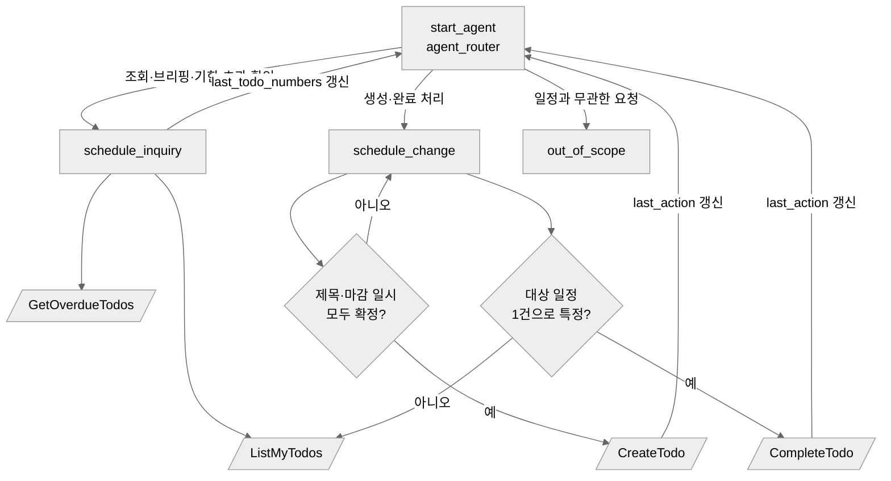

# Agent Spec: AgentToDo_Assistant

## Purpose & Scope

AgentToDo 워크스페이스 안에서 사용자의 일정(`AgentToDo_Task__c`)을 자연어로
조회·브리핑·생성·완료 처리하는 사내 직원용 에이전트입니다.

이 에이전트는 **AgentToDo LWC 앱의 대화 패널에서 Agent API를 통해 호출**됩니다.
Salesforce 표준 Agentforce 패널이 아니라 자체 UI가 세션을 열고 메시지를 주고받으며,
실행된 Agent Action을 대화 흐름과 별도의 카드로 렌더링합니다.
"앱이 에이전트를 어떻게 제어하는가"가 이 프로젝트의 학습 목표이므로,
연동 계층이 에이전트 자체만큼 중요한 산출물입니다.

**범위 밖:** 일정 삭제, 타인 일정 조회/변경, 일반 지식 질의응답.

## Behavioral Intent

- **행동 전에 알아야 할 것**: 생성 요청은 제목과 마감 일시가 모두 확정되어야 실행합니다.
  완료 요청은 대상 일정이 단 하나로 특정되어야 실행합니다.
- **Action 구현 유형**: 전부 invocable Apex(`@InvocableMethod`)입니다. Flow나 Prompt Template은
  쓰지 않습니다 — 모든 동작이 SOQL/DML이고, 소유자 범위 제한이 Apex에서 가장 명확합니다.
- **가드레일**:
  - 일정과 무관한 요청은 거절하고 이 에이전트가 할 수 있는 일을 한 문장으로 안내합니다.
  - 삭제 요청은 지원하지 않는다고 답하고 완료 처리를 대안으로 제시합니다.
  - 조회 결과가 0건이면 없다고 명확히 말하고 지어내지 않습니다.
- **서브에이전트 간 유지 상태**: 마지막 조회 결과의 TODO 번호 목록. 사용자가
  "그중 두 번째 완료해줘"처럼 참조할 수 있어야 합니다.
- **언어**: 한국어로 응답합니다.

## 실행 사용자와 데이터 범위 (중요)

Agent API를 **클라이언트 자격 증명 흐름(client credentials)** 으로 호출하므로
토큰에 묶인 사용자는 External Client App의 **Run As 사용자로 고정**됩니다.
LWC에 로그인한 사용자가 누구든 에이전트는 항상 같은 사용자로 실행됩니다.

**이번 구현의 결정:** Run As 사용자를 `ktnam.eafc6020fb96@agentforce.com`(남 경태)로 두고,
모든 Apex Action이 `WITH USER_MODE` + 실행 사용자 소유 레코드로 범위를 제한합니다.
Action은 사용자 Id를 **입력으로 받지 않습니다** — 받게 만들면 프롬프트로 타인의 Id를
주입해 남의 일정을 열람할 수 있는 통로가 생기기 때문입니다.

**한계 (문서화된 트레이드오프):** 이 설계는 단일 사용자 데모에서 정확합니다.
여러 사용자가 각자의 일정을 다루려면 사용자별 토큰(JWT bearer 등)으로 바꾸거나,
검증된 사용자 컨텍스트를 세션에 주입하는 별도 설계가 필요합니다.
지금 범위에서는 하지 않으며, 이 제약을 인지한 상태로 진행합니다.

## Subagent Posture

| Subagent           | Posture  | Why this posture?                                                                   | Deterministic controls                           |
| ------------------ | -------- | ----------------------------------------------------------------------------------- | ------------------------------------------------ |
| `agent_router`     | mixed    | 조회/변경 두 갈래만 있으므로 분류가 단순합니다                                      | 전이 불변식만                                    |
| `schedule_inquiry` | agentic  | 브리핑·정렬·요약은 자유도가 필요합니다. 읽기 전용이라 잘못돼도 되돌릴 것이 없습니다 | 없음                                             |
| `schedule_change`  | mixed    | 쓰기 동작이라 되돌리기 비용이 있습니다. 실행 전 확인 게이트를 둡니다                | 생성 시 파싱된 일시 확인, 완료 시 대상 단일 확정 |
| `out_of_scope`     | scripted | 거절 문구가 흔들릴 이유가 없습니다                                                  | 고정 응답                                        |

쓰기 경로에만 결정적 통제를 두는 이유: "내일 오후"처럼 모호한 자연어 날짜를
에이전트가 임의 해석해 엉뚱한 시각에 일정을 만드는 것이 가장 흔한 실패 모드입니다.

## Subagent Map



## Variables

- `last_todo_numbers` (mutable list[string] = []) — 직전 조회에서 보여준 TODO 번호.
  Set by: `ListMyTodos`, `GetOverdueTodos`. Read by: `schedule_change` — 사용자가
  순번이나 "그거"로 지칭할 때 대상을 특정하는 데 씁니다.
- `last_action` (mutable string = "") — 마지막으로 실행한 Action 이름.
  Set by: 모든 쓰기 Action. Read by: LWC 대화 패널이 Action 결과 카드를 그릴 때 참조합니다.

## Actions

### ListMyTodos (schedule_inquiry)

- **Target:** `apex://AgentToDoActions`
- **Status:** NEEDS CREATION

#### Inputs

| Name    | Type   | Required | Source                                          |
| ------- | ------ | -------- | ----------------------------------------------- |
| `scope` | string | No       | `today` / `week` / `open` 중 하나. 기본 `today` |

#### Outputs

| Name    | Type         | Visible to User? | Source              | Notes                                         |
| ------- | ------------ | ---------------- | ------------------- | --------------------------------------------- |
| `todos` | list[object] | Yes              | `AgentToDo_Task__c` | 번호·제목·시각·우선순위·상태                  |
| `count` | integer      | Yes              | Computed            | 0건 여부를 에이전트가 명확히 말하게 하는 근거 |

---

### GetOverdueTodos (schedule_inquiry)

- **Target:** `apex://AgentToDoActions`
- **Status:** NEEDS CREATION

#### Inputs

없음. 실행 사용자 기준으로 고정 조회합니다.

#### Outputs

| Name    | Type         | Visible to User? | Source              | Notes                  |
| ------- | ------------ | ---------------- | ------------------- | ---------------------- |
| `todos` | list[object] | Yes              | `AgentToDo_Task__c` | `Is_Overdue__c = true` |
| `count` | integer      | Yes              | Computed            |                        |

---

### CreateTodo (schedule_change)

- **Target:** `apex://AgentToDoActions`
- **Status:** NEEDS CREATION

#### Inputs

| Name       | Type     | Required | Source                                             |
| ---------- | -------- | -------- | -------------------------------------------------- |
| `subject`  | string   | Yes      | 사용자 발화                                        |
| `dueAt`    | datetime | Yes      | 사용자 발화에서 파싱. **실행 전 사용자 확인 필수** |
| `priority` | string   | No       | 기본 `Medium`                                      |
| `category` | string   | No       | 기본 `Work`                                        |

#### Outputs

| Name         | Type     | Visible to User? | Source | Notes            |
| ------------ | -------- | ---------------- | ------ | ---------------- |
| `todoNumber` | string   | Yes              | `Name` | 생성된 TODO-XXXX |
| `subject`    | string   | Yes              |        | 확인용 반향      |
| `dueAt`      | datetime | Yes              |        | 확인용 반향      |

생성 시 `Created_By_Agent__c = true`, `Last_Agent_Action__c = 'CreateTodo'` 를 기록해
상세 드로어의 "Agent 생성 여부"·"실행된 Agent Action"에 그대로 나타나게 합니다.

---

### CompleteTodo (schedule_change)

- **Target:** `apex://AgentToDoActions`
- **Status:** NEEDS CREATION

#### Inputs

| Name         | Type   | Required | Source                                                 |
| ------------ | ------ | -------- | ------------------------------------------------------ |
| `todoNumber` | string | Yes      | `TODO-0007` 형식. 사용자 발화 또는 `last_todo_numbers` |

#### Outputs

| Name          | Type    | Visible to User? | Source   | Notes                                             |
| ------------- | ------- | ---------------- | -------- | ------------------------------------------------- |
| `todoNumber`  | string  | Yes              |          |                                                   |
| `subject`     | string  | Yes              |          |                                                   |
| `alreadyDone` | boolean | Yes              | Computed | 이미 완료된 건을 다시 완료했다고 말하지 않기 위함 |

## Test Utterances (Phase 3 스모크 테스트)

| 발화                                    | 기대 라우팅        | 기대 Action                 |
| --------------------------------------- | ------------------ | --------------------------- |
| 오늘 일정을 브리핑해줘                  | `schedule_inquiry` | `ListMyTodos`               |
| 오늘 뭐 해야 하지?                      | `schedule_inquiry` | `ListMyTodos`               |
| 기한이 지난 일정을 알려줘               | `schedule_inquiry` | `GetOverdueTodos`           |
| 늦은 거 있어?                           | `schedule_inquiry` | `GetOverdueTodos`           |
| 내일 오후 3시에 코드 리뷰 일정 만들어줘 | `schedule_change`  | `CreateTodo` (일시 확인 후) |
| 내일 오후 일정 하나 만들어줘            | `schedule_change`  | 확인 질문만, Action 미실행  |
| TODO-0011을 완료 처리해줘               | `schedule_change`  | `CompleteTodo`              |
| 일정 하나 삭제해줘                      | `schedule_change`  | 거절 + 완료 처리 제안       |
| 오늘 날씨 어때?                         | `out_of_scope`     | 없음                        |

## LWC 연동 계층 (에이전트 외부)

```
agentAssistantDrawer (LWC)
  └─ @AuraEnabled AgentToDoAgentService (Apex)
       └─ Named Credential: AgentToDo_Agent_API  →  https://api.salesforce.com
            └─ External Credential (OAuth 2.0 · Client Credentials)
                 └─ External Client App (Run As: 남 경태)
```

| 단계        | 호출                                                        |
| ----------- | ----------------------------------------------------------- |
| 세션 시작   | `POST /einstein/ai-agent/v1/agents/{AGENT_ID}/sessions`     |
| 메시지 전송 | `POST /einstein/ai-agent/v1/sessions/{SESSION_ID}/messages` |
| 세션 종료   | `DELETE /einstein/ai-agent/v1/sessions/{SESSION_ID}`        |

`AGENT_ID`는 게시·활성화된 에이전트의 `BotDefinition.Id`(`0Xx...`)입니다.
스트리밍(`/messages/stream`, SSE)은 Apex 콜아웃에서 다루기 번거로우므로 동기 엔드포인트를 씁니다.

## 진행 순서와 수동 작업 경계

| 단계                                                 | 자동 | 수동 (당신)              |
| ---------------------------------------------------- | ---- | ------------------------ |
| 3a. Apex Invocable Action 5종 + 테스트               | ●    |                          |
| 3b. Agent Script 오소링 번들 작성·검증               | ●    |                          |
| 3c. `sf agent preview` 스모크 테스트 + 트레이스 확인 | ●    |                          |
| 3d. 게시(publish) + 활성화(activate)                 | ●    | 승인                     |
| 3e. External Client App 생성 · OAuth 설정            |      | ●                        |
| 3f. External Credential + Named Credential 등록      | ●    | Consumer Key/Secret 입력 |
| 3g. Apex 연동 서비스 + LWC 배선                      | ●    |                          |

3a~3d는 수동 작업 없이 진행 가능합니다. 3e에서 처음으로 당신의 개입이 필요하며,
그 시점에 단계별 절차를 정리해 드립니다.
